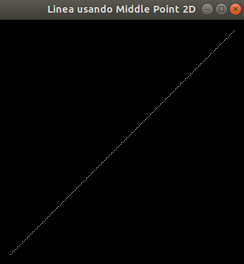

# Repositorio de Computación Grafica - CS 2019
Fase II
- Profesor: Dr. Juan Carlos Gutierrez Caceres
- Estudiante: Hayde Luzmila Humpire Cutipa

Requerimientos:
- OpenGL (ubuntu)
```
$ sudo apt-get update
$ sudo apt-get install libglu1-mesa-dev freeglut3-dev mesa-common-dev
```
# 1. Resultado de la grafica de la Recta-2D


# 2. Resultado de la grafica de la Circunferencia


# 5. Resultado del Pintado

