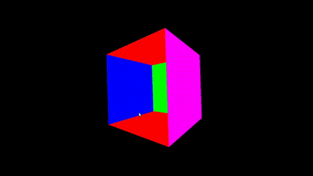
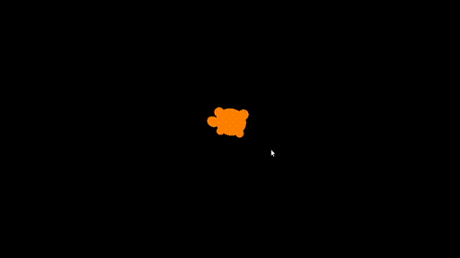
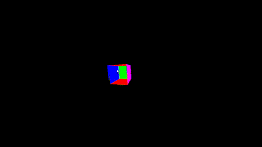
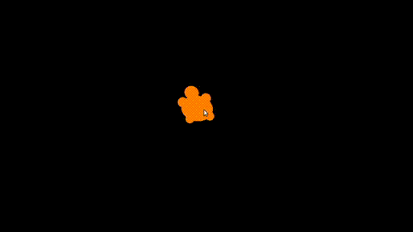
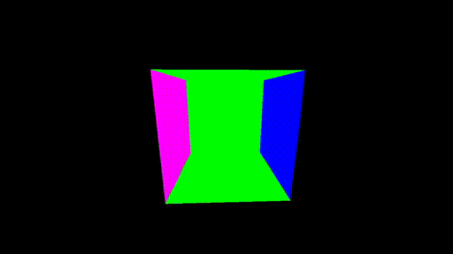
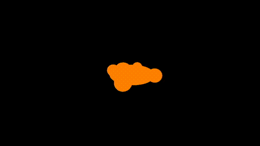
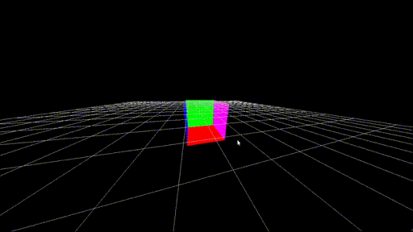
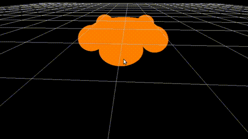
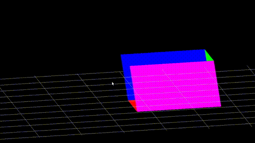
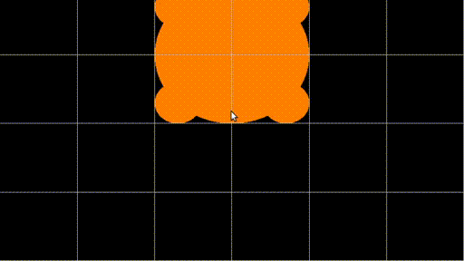

# Repositorio de Computación Grafica Cs 2019
Fase II 

- Profesor: 
Dr. Juan Carlos Gutierrez Caceres

- Estudiante: 
Hayde Luzmila Humpire Cutipa

## Requerimientos:
- OpenGL (ubuntu)
```
$ sudo apt-get update
$ sudo apt-get install libglu1-mesa-dev freeglut3-dev mesa-common-dev
```
## Viendo la escena desde otro punto de vista: CÁMARAS
- Mover la cámara con el mouse
- Cambios de perspectiva de la cámara (ortogonal a perspectiva) 
- Mover el objeto en la proyección (con las teclas)
- Otros modos de movimiento de cámara como son el MODO PAN o el MODO TRÍPODE

## Para compilar: 
```
g++ main.cpp Camara.cpp Vector_tools.cpp primitivas.cpp -o out  -lGL -lGLU -lglut
```
# 1. Mover la cámara con el mouse
```
GlutMouseFunc(mouse); //Pulsado de Botones
glutMotionFunc(NULL); //Movimiento con Botones pulsados
glutPassiveMotionFunc(MouseMotion); //Movimientos sin Botones pulsados
```

## Gráfica con el movimiento del mouse - (con el cubo y la tortuga)



## Gráfica dando click - (con el cubo y la tortuga)



# 2. Mover el objeto en la proyección con las teclas
## Gráfica de proyección con teclas - (con el cubo y la tortuga)



# 3. Programa con tecla que permite cambiar el modo de proyección entre ORTOGONAL y PERSPECTIVA
## Gráfica Ortogonal - (con el cubo y la tortuga)



## Gráfica Perpectiva - (con el cubo y la tortuga)



# 4. Otros modos de movimiento de cámara como son el MODO PAN o el MODO TRÍPODE
## Gráfica Modo PAN
```
void Modo_Pan(int x, int y){
    float avance_x, avance_y;
    avance_x = (float)(old_x - x) / 10;
    avance_y = (float)(y - old_y) / 10;
    MiCamara->PanCamera(avance_x, avance_y);
    old_y = y;
    old_x = x;
    glutPostRedisplay();
}
```
## Gráfica MODO TRÍPODE
```
void Modo_Tripode(int x, int y){
    float rotacion_x, rotacion_y;
    rotacion_x = (float)(old_x - x) * DEGREE_TO_RAD / 5;
    rotacion_y = (float)(old_y - y) * DEGREE_TO_RAD / 5;
    MiCamara->YawCamera(rotacion_x);
    MiCamara->PitchCamera(rotacion_y);
    old_y = y;
    old_x = x;
    glutPostRedisplay();
}
```
