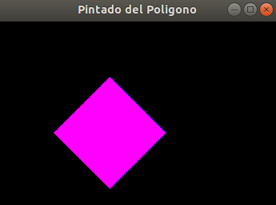

# Repositorio de Computación Grafica - CS 2019
Fase I
- Profesor: Dr. Juan Carlos Gutierrez Caceres
- Estudiante: Hayde Luzmila Humpire Cutipa

Requerimientos:
- OpenGL (ubuntu)
```
$ sudo apt-get update
$ sudo apt-get install libglu1-mesa-dev freeglut3-dev mesa-common-dev
```
# 1.1 Resultado de la grafica de la Recta-2D


# 1.2 Resultado de la grafica de la Recta-3D


# 2. Resultado de la grafica de la Circunferencia


# 3. Resultado de la grafica del Polígono


# 4.1 Resultado de la grafica de la Traslación


# 4.2 Resultado de la grafica de la Rotación


# 4.3 Resultado de la grafica del Escalar


# 5. Resultado del Pintado



