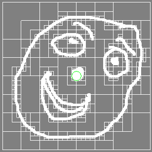
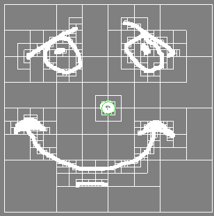
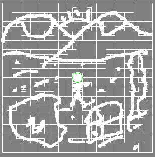
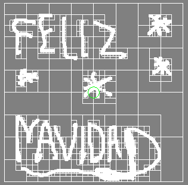

# Repositorio de Computación Grafica Cs 2019
Fase III 

- Profesor: 
Dr. Juan Carlos Gutierrez Caceres

- Estudiante: 
Hayde Luzmila Humpire Cutipa

## Trabajos para la Tercera Fase
- Curva de Bézier
- Quad Tree

## Para compilar: 
```
g++ main.cpp -o ejecutable -lglut -lGLU -lGL
```
# 1. Curva de Bézier
## Gráfica de la Curva de Bézier con tres puntos


## Gráfica de la Curva de Bézier con cuatro puntos


# 2. Quad Tree
## Gráfica del Quad Tree




