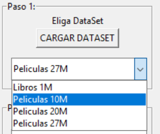
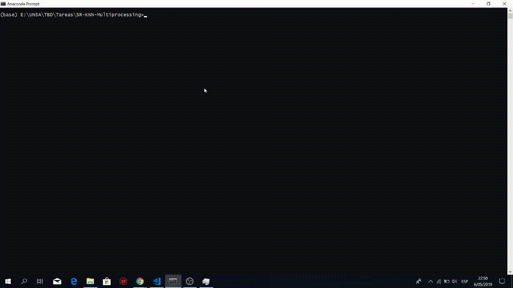

# Repositorio de Computación Grafica - CS 2019
Profesor: 
- Dr. Juan Carlos Gutierrez Caceres

Estudiante:
- Hayde Luzmila Humpire Cutipa

Requerimientos:
- OpenGL (ubuntu)
```
$ sudo apt-get update
$ sudo apt-get install libglu1-mesa-dev freeglut3-dev mesa-common-dev
```

# 1.Circunferencia
El siguiente código ilustra los procedimientos que podrían emplearse para implementar el
algoritmo del punto medio para generación de círculos. Al procedimiento circleMidpoint hay que pasarle
el valor del radio del círculo y las coordenadas del centro del círculo. Entonces, se calcula una posición de
píxel dentro del primer octante de la trayectoria circular y se pasa dicha posición al procedimiento
circlePlotPoints . Este procedimiento almacena el color correspondiente al círculo en el búfer de imagen
para todas las posiciones simétricas dentro del círculo, efectuando llamadas repetidas a las rutina setPixel ,
que está implementada con las funciones de dibujo de puntos de OpenGL.
```
for artist in neighborRatings: #buscar las calificaciones que el vecino hizo y el usuario no hizo
    if not artist in userRatings:
        if neighborRatings[artist] >= self.umbral or self.umbral==0: #Consideracion de umbral
            if artist not in recommendations:
                recommendations[artist] = neighborRatings[artist]
            else:
                recommendations[artist] = (recommendations[artist] + neighborRatings[artist])/2 #Obtener un ponderado

```


# 2.A Recta-2D
El sistema de recomendación esta preparado para trabajar con 4 bases de datos: Books de 1M, Movielens de 10M, Movielens de 20M y Movielens de 27M.
```
for artist in neighborRatings: #buscar las calificaciones que el vecino hizo y el usuario no hizo
    if not artist in userRatings:
        if neighborRatings[artist] >= self.umbral or self.umbral==0: #Consideracion de umbral
            if artist not in recommendations:
                recommendations[artist] = neighborRatings[artist]
            else:
                recommendations[artist] = (recommendations[artist] + neighborRatings[artist])/2 #Obtener un ponderado

```


# 2.B Recta-3D
El sistema de recomendación esta preparado para trabajar con 4 bases de datos: Books de 1M, Movielens de 10M, Movielens de 20M y Movielens de 27M.
```
for artist in neighborRatings: #buscar las calificaciones que el vecino hizo y el usuario no hizo
    if not artist in userRatings:
        if neighborRatings[artist] >= self.umbral or self.umbral==0: #Consideracion de umbral
            if artist not in recommendations:
                recommendations[artist] = neighborRatings[artist]
            else:
                recommendations[artist] = (recommendations[artist] + neighborRatings[artist])/2 #Obtener un ponderado

```


# 3.Polígono
El sistema de recomendación esta preparado para trabajar con 4 bases de datos: Books de 1M, Movielens de 10M, Movielens de 20M y Movielens de 27M.
```
for artist in neighborRatings: #buscar las calificaciones que el vecino hizo y el usuario no hizo
    if not artist in userRatings:
        if neighborRatings[artist] >= self.umbral or self.umbral==0: #Consideracion de umbral
            if artist not in recommendations:
                recommendations[artist] = neighborRatings[artist]
            else:
                recommendations[artist] = (recommendations[artist] + neighborRatings[artist])/2 #Obtener un ponderado

```


# 4.Traslación, Rotación y Escalar 2D
El sistema de recomendación esta preparado para trabajar con 4 bases de datos: Books de 1M, Movielens de 10M, Movielens de 20M y Movielens de 27M.
```
for artist in neighborRatings: #buscar las calificaciones que el vecino hizo y el usuario no hizo
    if not artist in userRatings:
        if neighborRatings[artist] >= self.umbral or self.umbral==0: #Consideracion de umbral
            if artist not in recommendations:
                recommendations[artist] = neighborRatings[artist]
            else:
                recommendations[artist] = (recommendations[artist] + neighborRatings[artist])/2 #Obtener un ponderado

```


# 5.Pintar
El sistema de recomendación esta preparado para trabajar con 4 bases de datos: Books de 1M, Movielens de 10M, Movielens de 20M y Movielens de 27M.

```
for artist in neighborRatings: #buscar las calificaciones que el vecino hizo y el usuario no hizo
    if not artist in userRatings:
        if neighborRatings[artist] >= self.umbral or self.umbral==0: #Consideracion de umbral
            if artist not in recommendations:
                recommendations[artist] = neighborRatings[artist]
            else:
                recommendations[artist] = (recommendations[artist] + neighborRatings[artist])/2 #Obtener un ponderado

```


# Resultado Final: Animacion de todos los resultados 
Ejecución del codigo y prueba de funcionalidad:



