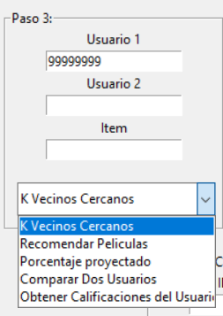

# Computacion-Grafica
Repositorio del curso de computación gráfica - Ciencia de la computacion 2019

# SR-KNN-Multiprocessing
Sistema de recomendación basado en usuarios, usando KNN 

Curso: Topicos de Bases de datos
Integrantes:
- Jair Huaman Canqui
- Hayde Humpire Cutipa

Este sistema primero preprocesa los datos y los almacena en una estructura de tipo diccionario donde se cumple lo siguiente: dict["usuario"]["item"] = rating, solo se almacenan los ratings calificados y no se consideran los rating no calificados para evitar desperdiciar memoria.
Luego de que se hace el pre-procesamiento se almacena los datos en disco, este sistema de recomendación hace uso del disco como apoyo para evitar sobrecargar la memoria RAM, cada vez que se necesita cargar la base de datos, solo se levanta el archivo pkl en el sistema de recomendación, lo cual es muy veloz y no toma mas de 4 segundos para 27 millones de datos.
Los archivos de pkl de las bases de datos pre-procesadas se encuentran en el siguiente link: https://drive.google.com/file/d/1_3a-V46mrLyWsgUP9bCMCu8vKkjb3xPI/view?usp=sharing

```
def save_obj(self, obj, name ):
    with open('pkl_files/'+ name + '.pkl', 'wb') as f:
        pickle.dump(obj, f, pickle.HIGHEST_PROTOCOL)

def load_obj(self, name ):
    with open('pkl_files/' + name + '.pkl', 'rb') as f:
        return pickle.load(f)
```

#####################################################################################

Ejecución del codigo y prueba de funcionalidad:


######################################################################################

Este sistema no usa librerias externas para hacer calculos referentes a las recomendaciones ni calculos de distancias, toda la implementación se hace en el codigo, solo se usa lo siguiente:

"pandas" para el almacenamiento de arrays
Tkinter para la interfaz grafica.
El sistema de recomendación fue realizado con el lenguaje de programación python 3.6
Hace uso de la libreria codecs para leer linea por linea los dataset y convertir los datos utf8 para que sean reconocidos por el sistema.
Hace uso de la libreria multiprocessing para dividir las tareas entre todos los nucleos disponibles

Si se empieza desde una instalación limpia de python se necesitara ejecutar los siguientes comandos para obtener lo necesario.

Ubuntu:
```
  sudo apt-get install python3-tk
```
  
Windows: Descargar la ultima version de "ActiveTcl" e instalar
  
Cualquier OS:
```
  pip install pandas
```
  
######################################################################################

Para realizar el calculo de distancias entre un usuario y todos los usuarios se aprovechan todos los procesadores de la computadora, Usando Multiprocessing en python, hacemos que cada procesador procese la distancia lo que reduce bastante el tiempo para realizar una recomendación o calcular k-vecinos, en una base de datos de 27 millones el calculo de distancias puede tardar 8 segundos y en una base de datos de 20 millones puede tardar 5 segundos.

```
#Calculo de las distancias usando paralelismo.
print("Total de usuarios:", tamTotal)
self.username = username
ratingsUser = [username,self.data[username]]
dictlist = []
dictlist = [ (ratingsUser, [k,v]) for k, v in self.data.items() if k != username]
t = time.process_time()
number_of_workers = 12 #Numero de nucleos disponibles
with Pool(number_of_workers) as p:
    if self.metric == "pearson":
        #startmap puede recibir multiples variables, aqui recibe las calificaciones del usuario y el vecino
        distances = p.starmap(pearson_mp, dictlist) 
    elif self.metric == "manhattan":
        distances = p.starmap(distanciaManhattan_mp, dictlist)
    elif self.metric == "euclidiana":
        distances = p.starmap(distanciaEuclidiana_mp, dictlist)
    elif self.metric == "coseno":
        distances = p.starmap(similitudCoseno_mp, dictlist)

```

En el caso del uso del umbral al realizar las recomendaciones, solo consideramos las peliculas de los k vecinos que tienen una calificacion mayor o igual al umbral y que el usuario objeto de la recomendacion no ha calificado.

```
for artist in neighborRatings: #buscar las calificaciones que el vecino hizo y el usuario no hizo
    if not artist in userRatings:
        if neighborRatings[artist] >= self.umbral or self.umbral==0: #Consideracion de umbral
            if artist not in recommendations:
                recommendations[artist] = neighborRatings[artist]
            else:
                recommendations[artist] = (recommendations[artist] + neighborRatings[artist])/2 #Obtener un ponderado

```

El sistema de recomendación esta preparado para trabajar con 4 bases de datos: Books de 1M, Movielens de 10M, Movielens de 20M y Movielens de 27M.


En el sistema podemos realizar las siguientesa acciones:



######################################################################################

